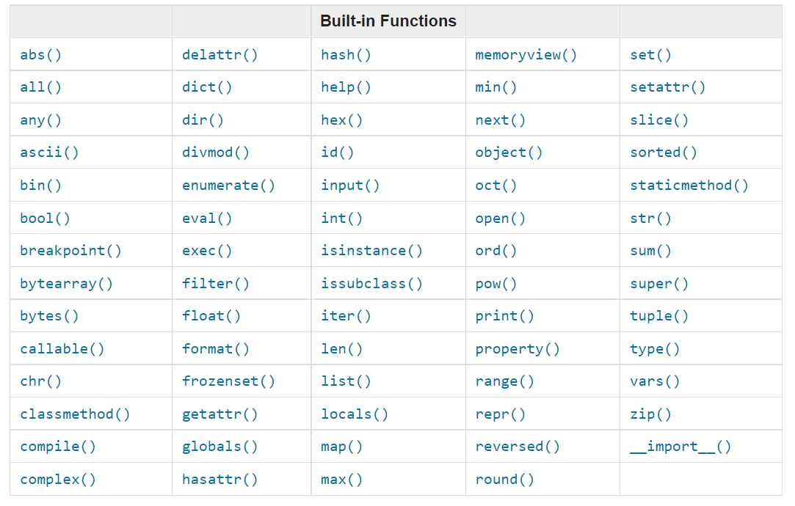
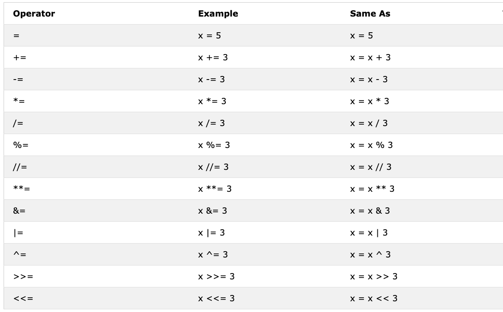

# Fase 1: Fundamentos de Python
Para abordar los fundamentos de python, vamos a utilizar un repositorio de GitHub llamado "30-Days-Of-Python".
## Día 1: Introducción
Python es un lenguaje de programación de alto nivel para programación general, de código abierto y orientado a objetos.

- Alto nivel: utiliza una sintaxis más similar al lenguaje humano. Esto significa que es un lenguaje "menos técnico" que otros.
- De código abierto: básicamente significa que Python es público, cualquiera puede usarlo, modificarlo, mejorarlo, etc.
- Orientado a objetos: es una forma de ordenar el código. Generalmente se definen objetos con sus propiedades y acciones posibles.

Python es un lenguaje fácil de aprender y de usar, y es utilizado en diversas industrias y distintas aplicaciones. Ampliamenta adoptado en la ciencia de datos.

### Operaciones básicas
Podemos hacer operaciones matemáticas básicas (suma, resta, multiplicación, división, etc). Me interesa anotar algunas:
- Potencia: el símbolo es "**" --> 3 ** 2 = 9
- Obtener el resto de una división: el símbolo es % --> 4 % 2 = 0 y 3 % 2 = 1
- Eliminar el resto: es decir, muestra el cociente de la división, su símbolo es "//" --> 25 // 3 = 8

### Python básico
Se puede codear en la terminal o en una aplicación como VSCode, y los archivos terminan en .py.

**Sangría en Python**
Se utiliza para formar bloques de código, los errores o *"bugs"* pueden darse por utilizar mal las sangrías.

**Comentarios**
Para comentar en Python se úsa el hashtag (#). Los comentarios son parte del código que no se ejecutan y sirve principalmente a los programadores para dejar notas, ordenar el código, y facilitar su entendimiento.

Por ejemplo:
 ```python
# Esto es un comentario
```

### Tipos de datos
Existen diferentes tipos de datos, ahora sólo vemos los escenciales.

**Números**
- Integer: son los números enteros (negativos, positivos y el cero). Ej: -3, -2, -1, 0, 1, 2, 3 ...
- Float: serían los reales, todos los números, con decimales incluidos. Ej: -1.1, -1.0, 0.1, 1.23, etc.
- Complex: números complejos. Ej: 1 + j; 2 - 4j

**String**

Es el conjunto de uno o más caracteres entre comillas simples o dobles. Puede ser desde una letra, hasta un párrafo. 
Los strings se escriben **siempre entre comillas** (simples o dobles):

```python
nombre = "Martin"
mensaje = 'Hola, ¿cómo estás?'
parrafo = "Este es un texto más largo que puede ocupar varias palabras"
```
Python automáticamente entiende que eso es texto, no código.

**Booleans**

Un tipo de datos booleano es un valor de verdadero (True) o falso (False). T y F deben escribirse siempre en mayúsculas. Por ejemplo:

```python
True # ¿La luz está prendida? Si está prendida, entonces es True.
False # ¿La luz está prendida? Si está apagada, entonces es False.
```
**Lista**

Es un elemento que permite almacenar un conjunto ordenado de distintos tipos de datos. Ej:

```python
[0, 1, 2, 3, 4, 5]  # Una lista de números
['Banana', 'Orange', 'Mango', 'Avocado'] # Una lista de strings
['Finland','Estonia', 'Sweden','Norway'] # Otra lista de strings
['Banana', 10, False, 9.81] # Una lista con distintos tipos de datos: strings, integer, float, boolean.
```

**Diccionario**

Es un conjunto no ordenado de datos en formato clave-valor. Es como un diccionario donde la palabra es la clave y la definición es el valor. Ej:

```python
persona = {
    "nombre": "Martin",      # clave: valor
    "edad": 22,              # clave: valor
    "ciudad": "Mendoza",     # clave: valor
    "carrera": "Ingeniería"  # clave: valor
}

print(persona["nombre"])    # Martin
print(persona["edad"])      # 22
print(persona["ciudad"])    # Mendoza
```
La diferencia principal con la lista es el acceso a los datos. En las listas, es posibles acceder al dato a través de su índice, que es la posición de la lista en la cual se encuentra el mismo. En cambio, el diccionario permite acceder al dato mediante la clave, como se muestra en el ejemplo. 

*¿Qué tiene de diferente a asignar valores a variables?* El diccionario funciona mejor cuando se tienen muchos datos agrupados. Le pregunté a Claude, pero todavía no entiendo la ventaja. Repasar cuando avance más si es necesario. De momento, es mejor saber que el diccionario es mejor cuando se trabajan con datos que van juntos, como la información de una persona.

**Tupel**

Son como las listas, pero una vez creadas no se pueden modificar.

```python
('Earth', 'Jupiter', 'Neptune', 'Mars', 'Venus', 'Saturn', 'Uranus', 'Mercury') # planetas
```

**Set**

Un set es una colección de valores únicos (sin duplicados) que no tiene orden específico. 

A diferencia de las listas, los sets no mantienen un orden, y a diferencia de las tuplas, se pueden modificar (agregar o eliminar elementos).

Ejemplo:

```python
mi_set = {1, 2, 3, 4}

# Si intentas agregar un duplicado, se ignora
mi_set.add(2)
print(mi_set)  # {1, 2, 3, 4}  - No cambió nada

# Puedes agregar un valor nuevo
mi_set.add(5)
print(mi_set)  # {1, 2, 3, 4, 5}

# Puedes eliminar elementos
mi_set.remove(3)
print(mi_set)  # {1, 2, 4, 5}
```

Característica principal: **Solo almacena valores únicos. Si hay duplicados, se eliminan automáticamente.**

**Chqeueo del tipo de dato**: para verificar el tipo de dato almacenado en una variable se utiliza la función *type*

### Archivo de Python
Acá básicamente se explica lo que es un archivo de python y lo más importante a destacar es la función *print* que sirve para que se muestre lo que queremos al correr un código. Cuando corremos un código fuera de la Python Shell, no se muestran los resultados automáticamente, por eso en el código tenemos que isar la función *print* para mostrar lo que nosotros queramos al poner en marcha el código.

Se explica cómo usar VSCode para escribir código y correrlo en la terminal nativa. Ya lo había aprendido con Claude, de igual forma realicé el ejercicio propuesto, creando un archivo llamado *"Day1.py "*.

## Día 2: Variables, funciones nativas

### Funciones nativas
Python cuenta con una serie de funciones propias, que se pueden usar de manera estándar, sin importar ni configurar nada. Entre las más comunes encontramos: print(), len(), type(), int(), float(), str(), input(), list(), dict(), min(), max(), sum(), sorted(), open(), file(), help(), and dir(). Esta imagen tiene funciones de python:



Las funciones más comunes son:
- print(): como ya vimos sirve para mostrar resultados o lo que nosotros queramos al correr el código.
- len(): cuenta el número de caracteres del dato contando espacios.
- type(): verifica el tipo de dato.
- str(): convierte el dato a string.
- int(): convierte el dato a número entero.
- float(): convierte el dato a número con decimales.
- input(): sirve para que el usuario ingrese el dato.
- help ('keywords'): nos muestra toda las palabras reservadas de python. Éstas no pueden ser utilizadas para declarar variables o definir funciones nuevas.
- help (str): muestra documentación completa sobre strings: qué es, qué puedes hacer con ellos, etc.
- dir (str): muestra todas las funciones disponibles para strings.
- min(): da el valor mínimo entre los datos del argumento (sueltos en lista)
- max(): da el valor máximo entre los datos del argumento (sueltos o en lista)
- sum(): suma los elementos de la lista (funciona sólo con listas)

### Variables

Una variable es básicamente un espacio en la memoria de la computadora en la cual se va a guardar un dato. Las variables son nombradas, de manera tal que su nombre es la dirección del espacio en la memoria en la que se guarda el dato. Para nombrar una variable, es altamente recomendable colocarle un nombre fácil de asociar y recordar. 

Reglas para nombrar a una variable:
- Debe empezar con una letra.
- No puede empezar con un número o un carácter especial.
- Sólo puede contener carácteres alfanuméricos y guión bajo (A-z, 0-9, y _).
- Las mayúsculas importan (familyname, FamilyName,familyName se consideran variables distintas).

Algunos ejemplos de nombres válidos:

```python
firstname
lastname
age
country
city
first_name
last_name
capital_city
_if # if we want to use reserved word as a variable
year_2021
year2021
current_year_2021
birth_year
num1
num2
```

Algunos nombres inválidos:

```python
first-name
first@name
first$name
num-1
1num
```

Existe una convención ampliamente utilizada para nombrar variables que consiste en que cuando el nombre de una variable contiene más de una palabra, las mismas se separan con un guión bajo. Ej: *family_name*

Para guardar un valor dentro de una variable se utiliza el símbolo igual (=). Al asignarle un determinado tipo de dato a la variable, se dice que hacemos una *declaración de variable*.

Las variables pasan a ser los argumentos de las funciones que vimos más arriba. También es posible hacer que el usuario asigne un dato a la variable utilizando la función input. Ej: 
```python
first_name = input('Enter your first name:')
```

**Casting - Convertir Tipos de Datos**

Para hacer operaciones entre datos, generalmente deben ser del **mismo tipo**. Si no, Python da error.

```python
# ERROR - tipos incompatibles
print("Mi edad es " + 22)

# SOLUCIÓN - convertir a string
print("Mi edad es " + str(22))  # Mi edad es 22
```

**Funciones de conversión:**
- `int()` - convierte a número entero
- `float()` - convierte a decimal
- `str()` - convierte a texto

**Cuando tengas error por tipos incompatibles, convierte uno de los datos al tipo del otro.**

## Día 3: Operadores

### Boolean

Un dato del tipo booleano representa uno de los de estos dos valores: *True* (Verdadero) o *False* (Falso). Notar que deben comenzar con mayúsculas. El uso de estos valores se aclarará cuando veamos la operación de comparación, por ejemplo.

### Operadores

El lenguaje de python tiene varios tipos de operadores.

**Operadores de asignación**

Estos operadores se utilizan para asignar valores a las variables. El operador más comun, como ya vimos es el signo igual (=). En la imágen podemos encontrar otros operadores de este tipo.



**Operadores aritméticos**
Ya los vimos, son los que se utilizan para sumar, restar, multiplicar, etc.


**Operadores de comparación**

A la hora de programar, suele ser útil comparar valores. Para ello usamos los operadores de comparación. Al comparar dos valores, podemos verificar si son iguales, si son distintos, si uno es mayor o menor que el otro, etc. En la siguiente imágen vemos los operadores de comparación que podemos usar en python.


Como resultado vamos a obtener valores booleanos, es decir, verdadero o falso. Ejemplos:

```python
print(3 > 2)     # True, because 3 is greater than 2
print(3 >= 2)    # True, because 3 is greater than 2
print(3 < 2)     # False,  because 3 is greater than 2
print(2 < 3)     # True, because 2 is less than 3
print(2 <= 3)    # True, because 2 is less than 3
print(3 == 2)    # False, because 3 is not equal to 2
print(3 != 2)    # True, because 3 is not equal to 2
print(len('mango') == len('avocado'))  # False
print(len('mango') != len('avocado'))  # True
print(len('mango') < len('avocado'))   # True
print(len('milk') != len('meat'))      # False
print(len('milk') == len('meat'))      # True
print(len('tomato') == len('potato'))  # True
print(len('python') > len('dragon'))   # False


# Comparing something gives either a True or False

print('True == True: ', True == True) #True
print('True == False: ', True == False) #False
print('False == False:', False == False) #True
```
En adición a los operadores de comparación que vimos antes, también se python tiene:

- *is*: compara si dos variables son el mismo objeto en memoria. 
- *is not*: compara si dos variables **no** son el mismo objeto en la memoria.
- *in*: verifica si un elemento está dentro de una colección, entendiendo a colección cómo cualquier cosa que tenga mútiples elementos (listas, string, tuplas, diccionarios, ser, rangos).
- *not in*: verifica que un elemento **no** esté dentro de una colección.

Ejemplos:
```python
print('1 is 1', 1 is 1)                   # True - because the data values are the same
print('1 is not 2', 1 is not 2)           # True - because 1 is not 2
print('A in Asabeneh', 'A' in 'Asabeneh') # True - A found in the string
print('B not in Asabeneh', 'B' in 'Asabeneh') # False - there is no uppercase B
print('coding' in 'coding for all') # True - because coding for all has the word coding
print('a in an:', 'a' in 'an')      # True
print('4 is 2 ** 2:', 4 is 2 ** 2)   # True
```

**Operadores lógicos**

Son tres: *and*, *or* y *not*. Son los operadores que se ven el lógica proposicional. 
- *and*: Es **verdadera** solo si **ambas** proposiciones son **verdaderas**.
- *or*: Es **Falsa** solo si **ambas** preposiciones son **falsas**.
- *not*: Es una negación, toma el valor opuesto a la preposición. Es decir, si una a es verdadero, not a es falso.


Ejemplos:
```python
print(3 > 2 and 4 > 3) # True - because both statements are true
print(3 > 2 and 4 < 3) # False - because the second statement is false
print(3 < 2 and 4 < 3) # False - because both statements are false
print('True and True: ', True and True)
print(3 > 2 or 4 > 3)  # True - because both statements are true
print(3 > 2 or 4 < 3)  # True - because one of the statements is true
print(3 < 2 or 4 < 3)  # False - because both statements are false
print('True or False:', True or False)
print(not 3 > 2)     # False - because 3 > 2 is true, then not True gives False
print(not True)      # False - Negation, the not operator turns true to false
print(not False)     # True
print(not not True)  # True
print(not not False) # False
```
 
Con lo visto hasta ahora, entendemos que podemos realizar muchas cosas al asignar valores a variables mediante funciones nativas y/o operadores como los vistos anteriormente. Todos estos conceptos básicos de programación los tengo de Cálculo Numérico, por lo que no voy a profundizar mucho más.

## Día 4: Strings

### String

Como ya vimos, un string es un tipo de dato conformado por una colección de caracteres que se encuentran entere comillas simples, dobles o triples (cuando son varias líneas de texto). Es en palabras simples, texto. Existen diversos métodos y funciones nativas para trabajar con strings, veremos algunas a continuación.

Ya hemos visto como se crean los stirngs, y también que la función *len()* nos permite saber la cantidad de caracteres del string. A continuación se muestran algunos ejemplos.

```python
letter = 'P'                # A string could be a single character or a bunch of texts
print(letter)               # P
print(len(letter))          # 1
greeting = 'Hello, World!'  # String could be made using a single or double quote,"Hello, World!"
print(greeting)             # Hello, World!
print(len(greeting))        # 13
sentence = "I hope you are enjoying 30 days of Python Challenge"
print(sentence)
 ```

Un string que ocupa múltiples líneas de código se escribe entre triples comillas (simples o dobles).

```python
multiline_string = '''I am a teacher and enjoy teaching.
I didn't find anything as rewarding as empowering people.
That is why I created 30 days of python.'''
print(multiline_string)

# Another way of doing the same thing
multiline_string = """I am a teacher and enjoy teaching.
I didn't find anything as rewarding as empowering people.
That is why I created 30 days of python."""
print(multiline_string)
```

### Concatenación de strings

Es posible unir strings, eso se llama concatenación:

```python
first_name = 'Asabeneh'
last_name = 'Yetayeh'
space = ' '
full_name = first_name  +  space + last_name
print(full_name) # Asabeneh Yetayeh
# Checking the length of a string using len() built-in function
print(len(first_name))  # 8
print(len(last_name))   # 7
print(len(first_name) > len(last_name)) # True
print(len(full_name)) # 16
```

### Secuencias de Escape en Strings

Las secuencias de escape son códigos especiales (que empiezan con `\`) que hacen cosas especiales dentro de strings.

**Ejemplos:**

```python
# \n - Nueva línea
print("Hola\nMundo")
# Output:
# Hola
# Mundo

# \t - Tab (tabulación)
print("Nombre\tEdad")
print("Martin\t22")
print("Juan\t25")
# Output:
# Nombre	Edad
# Martin	22
# Juan	25

# \\ - Barra invertida (\)
print("Ruta: C:\\Users\\marti\\archivo.txt")
# Output: Ruta: C:\Users\marti\archivo.txt

# \' - Comilla simple dentro de comilla simple
print('It\'s working')
# Output: It's working

# \" - Comilla doble dentro de comilla doble
print("Dijo \"Hola\"")
# Output: Dijo "Hola"
```

**Resumen**

Son trucos para hacer cosas especiales dentro de strings. Cuando Python ve `\` seguido de ciertos caracteres, lo interpreta como una instrucción especial.

### Formateo de Strings

En Python hay varias formas de insertar variables dentro de strings. Aquí están las tres principales:

#### 1. Operador % (Estilo Antiguo)

Usa el operador `%` con placeholders especiales:

```python
first_name = 'Martin'
last_name = 'Herrera'
language = 'Python'
formated_string = 'I am %s %s. I teach %s' % (first_name, last_name, language)
print(formated_string)
# Output: I am Martin Herrera. I teach Python

# Con números
radius = 10
pi = 3.14
area = pi * radius ** 2
formated_string = 'The area of circle with radius %d is %.2f.' % (radius, area)
print(formated_string)
# Output: The area of circle with radius 10 is 314.00.
```

**Placeholders:**
- `%s` - String
- `%d` - Integer
- `%f` - Float
- `%.2f` - Float con 2 dígitos decimales

#### 2. Método .format() (Moderno)

Usa `{}` como placeholders y el método `.format()`:

```python
first_name = 'Martin'
last_name = 'Herrera'
language = 'Python'
formated_string = 'I am {} {}. I teach {}'.format(first_name, last_name, language)
print(formated_string)
# Output: I am Martin Herrera. I teach Python

# Con operaciones
a = 4
b = 3
print('{} + {} = {}'.format(a, b, a + b))
# Output: 4 + 3 = 7

# Con decimales
print('{} / {} = {:.2f}'.format(a, b, a / b))
# Output: 4 / 3 = 1.33

# Otro ejemplo
radius = 10
pi = 3.14
area = pi * radius ** 2
formated_string = 'The area of a circle with radius {} is {:.2f}.'.format(radius, area)
print(formated_string)
# Output: The area of a circle with radius 10 is 314.00.
```

#### 3. F-Strings (Más Moderno - Python 3.6+)

Empezás el string con `f` e insertas variables entre `{}`:

```python
a = 4
b = 3

# Operaciones básicas
print(f'{a} + {b} = {a + b}')
# Output: 4 + 3 = 7

print(f'{a} - {b} = {a - b}')
# Output: 4 - 3 = 1

print(f'{a} * {b} = {a * b}')
# Output: 4 * 3 = 12

# Con decimales
print(f'{a} / {b} = {a / b:.2f}')
# Output: 4 / 3 = 1.33

print(f'{a} % {b} = {a % b}')
# Output: 4 % 3 = 1

print(f'{a} // {b} = {a // b}')
# Output: 4 // 3 = 1

print(f'{a} ** {b} = {a ** b}')
# Output: 4 ** 3 = 64

# Otro ejemplo con círculo
radius = 10
pi = 3.14
area = pi * radius ** 2
formated_string = f'The area of a circle with radius {radius} is {area:.2f}.'
print(formated_string)
# Output: The area of a circle with radius 10 is 314.00.
```

#### Comparación de los 3 métodos:

```python
a = 4
b = 3

# % (antiguo)
print('%d + %d = %d' % (a, b, a + b))

# .format() (moderno)
print('{} + {} = {}'.format(a, b, a + b))

# f-string (más moderno)
print(f'{a} + {b} = {a + b}')

# Todos dan: 4 + 3 = 7
```

#### Recomendación:

**Usar f-strings.** Son más legibles, más simples y es el estándar actual en Python.
