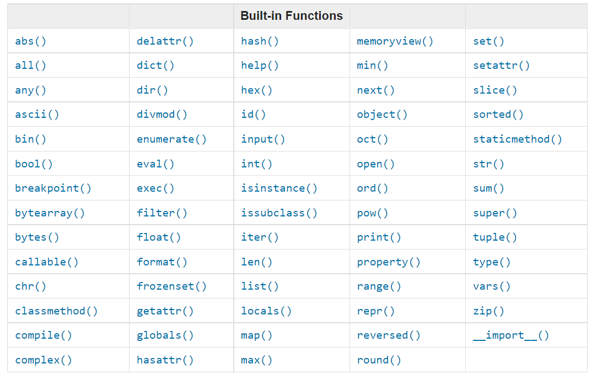
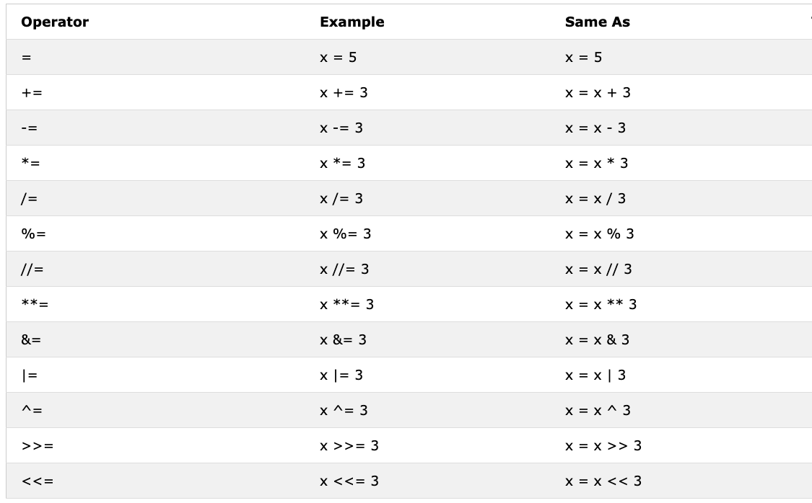
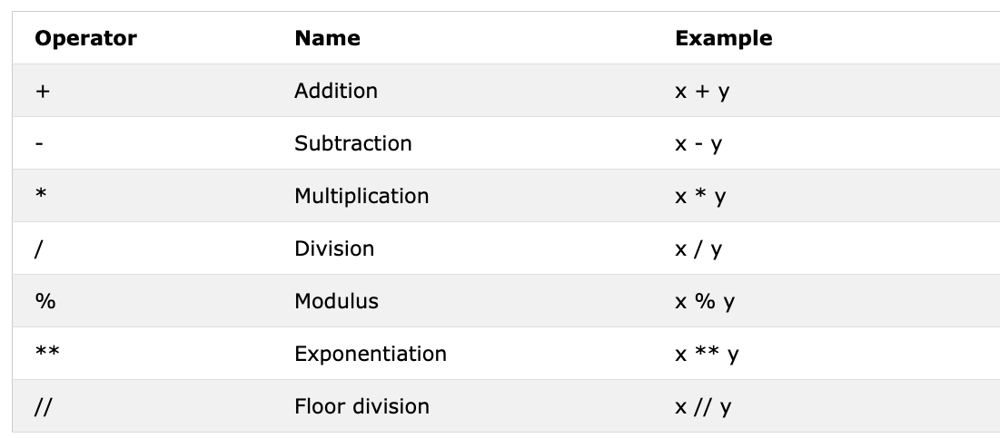
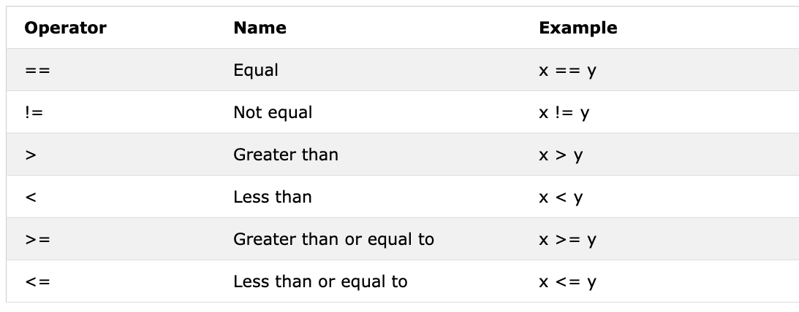
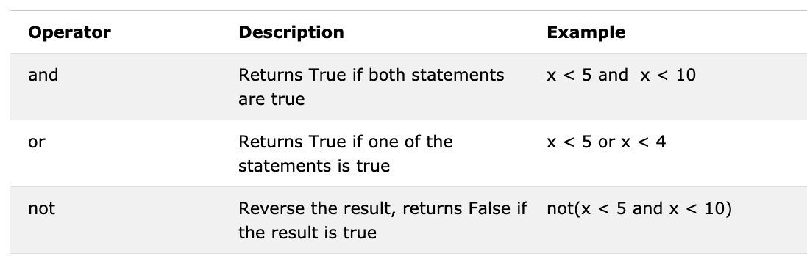
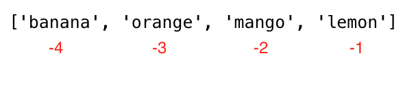

# Fase 1: Fundamentos de Python
Para abordar los fundamentos de python, vamos a utilizar un repositorio de GitHub llamado "30-Days-Of-Python".
## Día 1: Introducción
Python es un lenguaje de programación de alto nivel para programación general, de código abierto y orientado a objetos.

- Alto nivel: utiliza una sintaxis más similar al lenguaje humano. Esto significa que es un lenguaje "menos técnico" que otros.
- De código abierto: básicamente significa que Python es público, cualquiera puede usarlo, modificarlo, mejorarlo, etc.
- Orientado a objetos: es una forma de ordenar el código. Generalmente se definen objetos con sus propiedades y acciones posibles.

Python es un lenguaje fácil de aprender y de usar, y es utilizado en diversas industrias y distintas aplicaciones. Ampliamenta adoptado en la ciencia de datos.

### Operaciones básicas
Podemos hacer operaciones matemáticas básicas (suma, resta, multiplicación, división, etc). Me interesa anotar algunas:
- Potencia: el símbolo es "**" --> 3 ** 2 = 9
- Obtener el resto de una división: el símbolo es % --> 4 % 2 = 0 y 3 % 2 = 1
- Eliminar el resto: es decir, muestra el cociente de la división, su símbolo es "//" --> 25 // 3 = 8

### Python básico
Se puede codear en la terminal o en una aplicación como VSCode, y los archivos terminan en .py.

**Sangría en Python**
Se utiliza para formar bloques de código, los errores o *"bugs"* pueden darse por utilizar mal las sangrías.

**Comentarios**
Para comentar en Python se úsa el hashtag (#). Los comentarios son parte del código que no se ejecutan y sirve principalmente a los programadores para dejar notas, ordenar el código, y facilitar su entendimiento.

Por ejemplo:
 ```python
# Esto es un comentario
```

### Tipos de datos
Existen diferentes tipos de datos, ahora sólo vemos los escenciales.

**Números**
- Integer: son los números enteros (negativos, positivos y el cero). Ej: -3, -2, -1, 0, 1, 2, 3 ...
- Float: serían los reales, todos los números, con decimales incluidos. Ej: -1.1, -1.0, 0.1, 1.23, etc.
- Complex: números complejos. Ej: 1 + j; 2 - 4j

**String**

Es el conjunto de uno o más caracteres entre comillas simples o dobles. Puede ser desde una letra, hasta un párrafo. 
Los strings se escriben **siempre entre comillas** (simples o dobles):

```python
nombre = "Martin"
mensaje = 'Hola, ¿cómo estás?'
parrafo = "Este es un texto más largo que puede ocupar varias palabras"
```
Python automáticamente entiende que eso es texto, no código.

**Booleans**

Un tipo de datos booleano es un valor de verdadero (True) o falso (False). T y F deben escribirse siempre en mayúsculas. Por ejemplo:

```python
True # ¿La luz está prendida? Si está prendida, entonces es True.
False # ¿La luz está prendida? Si está apagada, entonces es False.
```
**Lista**

Es un elemento que permite almacenar un conjunto ordenado de distintos tipos de datos. Ej:

```python
[0, 1, 2, 3, 4, 5]  # Una lista de números
['Banana', 'Orange', 'Mango', 'Avocado'] # Una lista de strings
['Finland','Estonia', 'Sweden','Norway'] # Otra lista de strings
['Banana', 10, False, 9.81] # Una lista con distintos tipos de datos: strings, integer, float, boolean.
```

**Diccionario**

Es un conjunto no ordenado de datos en formato clave-valor. Es como un diccionario donde la palabra es la clave y la definición es el valor. Ej:

```python
persona = {
    "nombre": "Martin",      # clave: valor
    "edad": 22,              # clave: valor
    "ciudad": "Mendoza",     # clave: valor
    "carrera": "Ingeniería"  # clave: valor
}

print(persona["nombre"])    # Martin
print(persona["edad"])      # 22
print(persona["ciudad"])    # Mendoza
```
La diferencia principal con la lista es el acceso a los datos. En las listas, es posibles acceder al dato a través de su índice, que es la posición de la lista en la cual se encuentra el mismo. En cambio, el diccionario permite acceder al dato mediante la clave, como se muestra en el ejemplo. 

*¿Qué tiene de diferente a asignar valores a variables?* El diccionario funciona mejor cuando se tienen muchos datos agrupados. Le pregunté a Claude, pero todavía no entiendo la ventaja. Repasar cuando avance más si es necesario. De momento, es mejor saber que el diccionario es mejor cuando se trabajan con datos que van juntos, como la información de una persona.

**Tupel**

Son como las listas, pero una vez creadas no se pueden modificar.

```python
('Earth', 'Jupiter', 'Neptune', 'Mars', 'Venus', 'Saturn', 'Uranus', 'Mercury') # planetas
```

**Set**

Un set es una colección de valores únicos (sin duplicados) que no tiene orden específico. 

A diferencia de las listas, los sets no mantienen un orden, y a diferencia de las tuplas, se pueden modificar (agregar o eliminar elementos).

Ejemplo:

```python
mi_set = {1, 2, 3, 4}

# Si intentas agregar un duplicado, se ignora
mi_set.add(2)
print(mi_set)  # {1, 2, 3, 4}  - No cambió nada

# Puedes agregar un valor nuevo
mi_set.add(5)
print(mi_set)  # {1, 2, 3, 4, 5}

# Puedes eliminar elementos
mi_set.remove(3)
print(mi_set)  # {1, 2, 4, 5}
```

Característica principal: **Solo almacena valores únicos. Si hay duplicados, se eliminan automáticamente.**

**Chqeueo del tipo de dato**: para verificar el tipo de dato almacenado en una variable se utiliza la función *type*

### Archivo de Python
Acá básicamente se explica lo que es un archivo de python y lo más importante a destacar es la función *print* que sirve para que se muestre lo que queremos al correr un código. Cuando corremos un código fuera de la Python Shell, no se muestran los resultados automáticamente, por eso en el código tenemos que isar la función *print* para mostrar lo que nosotros queramos al poner en marcha el código.

Se explica cómo usar VSCode para escribir código y correrlo en la terminal nativa. Ya lo había aprendido con Claude, de igual forma realicé el ejercicio propuesto, creando un archivo llamado *"Day1.py "*.

## Día 2: Variables, funciones nativas

### Funciones nativas
Python cuenta con una serie de funciones propias, que se pueden usar de manera estándar, sin importar ni configurar nada. Entre las más comunes encontramos: print(), len(), type(), int(), float(), str(), input(), list(), dict(), min(), max(), sum(), sorted(), open(), file(), help(), and dir(). Esta imagen tiene funciones de python:



Las funciones más comunes son:
- print(): como ya vimos sirve para mostrar resultados o lo que nosotros queramos al correr el código.
- len(): cuenta el número de caracteres del dato contando espacios.
- type(): verifica el tipo de dato.
- str(): convierte el dato a string.
- int(): convierte el dato a número entero.
- float(): convierte el dato a número con decimales.
- input(): sirve para que el usuario ingrese el dato.
- help ('keywords'): nos muestra toda las palabras reservadas de python. Éstas no pueden ser utilizadas para declarar variables o definir funciones nuevas.
- help (str): muestra documentación completa sobre strings: qué es, qué puedes hacer con ellos, etc.
- dir (str): muestra todas las funciones disponibles para strings.
- min(): da el valor mínimo entre los datos del argumento (sueltos en lista)
- max(): da el valor máximo entre los datos del argumento (sueltos o en lista)
- sum(): suma los elementos de la lista (funciona sólo con listas)

### Variables

Una variable es básicamente un espacio en la memoria de la computadora en la cual se va a guardar un dato. Las variables son nombradas, de manera tal que su nombre es la dirección del espacio en la memoria en la que se guarda el dato. Para nombrar una variable, es altamente recomendable colocarle un nombre fácil de asociar y recordar. 

Reglas para nombrar a una variable:
- Debe empezar con una letra.
- No puede empezar con un número o un carácter especial.
- Sólo puede contener carácteres alfanuméricos y guión bajo (A-z, 0-9, y _).
- Las mayúsculas importan (familyname, FamilyName,familyName se consideran variables distintas).

Algunos ejemplos de nombres válidos:

```python
firstname
lastname
age
country
city
first_name
last_name
capital_city
_if # if we want to use reserved word as a variable
year_2021
year2021
current_year_2021
birth_year
num1
num2
```

Algunos nombres inválidos:

```python
first-name
first@name
first$name
num-1
1num
```

Existe una convención ampliamente utilizada para nombrar variables que consiste en que cuando el nombre de una variable contiene más de una palabra, las mismas se separan con un guión bajo. Ej: *family_name*

Para guardar un valor dentro de una variable se utiliza el símbolo igual (=). Al asignarle un determinado tipo de dato a la variable, se dice que hacemos una *declaración de variable*.

Las variables pasan a ser los argumentos de las funciones que vimos más arriba. También es posible hacer que el usuario asigne un dato a la variable utilizando la función input. Ej: 
```python
first_name = input('Enter your first name:')
```

**Casting - Convertir Tipos de Datos**

Para hacer operaciones entre datos, generalmente deben ser del **mismo tipo**. Si no, Python da error.

```python
# ERROR - tipos incompatibles
print("Mi edad es " + 22)

# SOLUCIÓN - convertir a string
print("Mi edad es " + str(22))  # Mi edad es 22
```

**Funciones de conversión:**
- `int()` - convierte a número entero
- `float()` - convierte a decimal
- `str()` - convierte a texto

**Cuando tengas error por tipos incompatibles, convierte uno de los datos al tipo del otro.**

## Día 3: Operadores

### Boolean

Un dato del tipo booleano representa uno de los de estos dos valores: *True* (Verdadero) o *False* (Falso). Notar que deben comenzar con mayúsculas. El uso de estos valores se aclarará cuando veamos la operación de comparación, por ejemplo.

### Operadores

El lenguaje de python tiene varios tipos de operadores.

**Operadores de asignación**

Estos operadores se utilizan para asignar valores a las variables. El operador más comun, como ya vimos es el signo igual (=). En la imágen podemos encontrar otros operadores de este tipo.



**Operadores aritméticos**
Ya los vimos, son los que se utilizan para sumar, restar, multiplicar, etc.



**Operadores de comparación**

A la hora de programar, suele ser útil comparar valores. Para ello usamos los operadores de comparación. Al comparar dos valores, podemos verificar si son iguales, si son distintos, si uno es mayor o menor que el otro, etc. En la siguiente imágen vemos los operadores de comparación que podemos usar en python.



Como resultado vamos a obtener valores booleanos, es decir, verdadero o falso. Ejemplos:

```python
print(3 > 2)     # True, because 3 is greater than 2
print(3 >= 2)    # True, because 3 is greater than 2
print(3 < 2)     # False,  because 3 is greater than 2
print(2 < 3)     # True, because 2 is less than 3
print(2 <= 3)    # True, because 2 is less than 3
print(3 == 2)    # False, because 3 is not equal to 2
print(3 != 2)    # True, because 3 is not equal to 2
print(len('mango') == len('avocado'))  # False
print(len('mango') != len('avocado'))  # True
print(len('mango') < len('avocado'))   # True
print(len('milk') != len('meat'))      # False
print(len('milk') == len('meat'))      # True
print(len('tomato') == len('potato'))  # True
print(len('python') > len('dragon'))   # False


# Comparing something gives either a True or False

print('True == True: ', True == True) #True
print('True == False: ', True == False) #False
print('False == False:', False == False) #True
```
En adición a los operadores de comparación que vimos antes, también se python tiene:

- *is*: compara si dos variables son el mismo objeto en memoria. 
- *is not*: compara si dos variables **no** son el mismo objeto en la memoria.
- *in*: verifica si un elemento está dentro de una colección, entendiendo a colección cómo cualquier cosa que tenga mútiples elementos (listas, string, tuplas, diccionarios, ser, rangos).
- *not in*: verifica que un elemento **no** esté dentro de una colección.

Ejemplos:
```python
print('1 is 1', 1 is 1)                   # True - because the data values are the same
print('1 is not 2', 1 is not 2)           # True - because 1 is not 2
print('A in Asabeneh', 'A' in 'Asabeneh') # True - A found in the string
print('B not in Asabeneh', 'B' in 'Asabeneh') # False - there is no uppercase B
print('coding' in 'coding for all') # True - because coding for all has the word coding
print('a in an:', 'a' in 'an')      # True
print('4 is 2 ** 2:', 4 is 2 ** 2)   # True
```

**Operadores lógicos**

Son tres: *and*, *or* y *not*. Son los operadores que se ven el lógica proposicional. 
- *and*: Es **verdadera** solo si **ambas** proposiciones son **verdaderas**.
- *or*: Es **Falsa** solo si **ambas** preposiciones son **falsas**.
- *not*: Es una negación, toma el valor opuesto a la preposición. Es decir, si una a es verdadero, not a es falso.



Ejemplos:
```python
print(3 > 2 and 4 > 3) # True - because both statements are true
print(3 > 2 and 4 < 3) # False - because the second statement is false
print(3 < 2 and 4 < 3) # False - because both statements are false
print('True and True: ', True and True)
print(3 > 2 or 4 > 3)  # True - because both statements are true
print(3 > 2 or 4 < 3)  # True - because one of the statements is true
print(3 < 2 or 4 < 3)  # False - because both statements are false
print('True or False:', True or False)
print(not 3 > 2)     # False - because 3 > 2 is true, then not True gives False
print(not True)      # False - Negation, the not operator turns true to false
print(not False)     # True
print(not not True)  # True
print(not not False) # False
```
 
Con lo visto hasta ahora, entendemos que podemos realizar muchas cosas al asignar valores a variables mediante funciones nativas y/o operadores como los vistos anteriormente. Todos estos conceptos básicos de programación los tengo de Cálculo Numérico, por lo que no voy a profundizar mucho más.

## Día 4: Strings

### String

Como ya vimos, un string es un tipo de dato conformado por una colección de caracteres que se encuentran entere comillas simples, dobles o triples (cuando son varias líneas de texto). Es en palabras simples, texto. Existen diversos métodos y funciones nativas para trabajar con strings, veremos algunas a continuación.

Ya hemos visto como se crean los stirngs, y también que la función *len()* nos permite saber la cantidad de caracteres del string. A continuación se muestran algunos ejemplos.

```python
letter = 'P'                # A string could be a single character or a bunch of texts
print(letter)               # P
print(len(letter))          # 1
greeting = 'Hello, World!'  # String could be made using a single or double quote,"Hello, World!"
print(greeting)             # Hello, World!
print(len(greeting))        # 13
sentence = "I hope you are enjoying 30 days of Python Challenge"
print(sentence)
 ```

Un string que ocupa múltiples líneas de código se escribe entre triples comillas (simples o dobles).

```python
multiline_string = '''I am a teacher and enjoy teaching.
I didn't find anything as rewarding as empowering people.
That is why I created 30 days of python.'''
print(multiline_string)

# Another way of doing the same thing
multiline_string = """I am a teacher and enjoy teaching.
I didn't find anything as rewarding as empowering people.
That is why I created 30 days of python."""
print(multiline_string)
```

### Concatenación de strings

Es posible unir strings, eso se llama concatenación:

```python
first_name = 'Asabeneh'
last_name = 'Yetayeh'
space = ' '
full_name = first_name  +  space + last_name
print(full_name) # Asabeneh Yetayeh
# Checking the length of a string using len() built-in function
print(len(first_name))  # 8
print(len(last_name))   # 7
print(len(first_name) > len(last_name)) # True
print(len(full_name)) # 16
```

### Secuencias de Escape en Strings

Las secuencias de escape son códigos especiales (que empiezan con `\`) que hacen cosas especiales dentro de strings.

**Ejemplos:**

```python
# \n - Nueva línea
print("Hola\nMundo")
# Output:
# Hola
# Mundo

# \t - Tab (tabulación)
print("Nombre\tEdad")
print("Martin\t22")
print("Juan\t25")
# Output:
# Nombre	Edad
# Martin	22
# Juan	25

# \\ - Barra invertida (\)
print("Ruta: C:\\Users\\marti\\archivo.txt")
# Output: Ruta: C:\Users\marti\archivo.txt

# \' - Comilla simple dentro de comilla simple
print('It\'s working')
# Output: It's working

# \" - Comilla doble dentro de comilla doble
print("Dijo \"Hola\"")
# Output: Dijo "Hola"
```

**Resumen**

Son trucos para hacer cosas especiales dentro de strings. Cuando Python ve `\` seguido de ciertos caracteres, lo interpreta como una instrucción especial.

### Formateo de Strings

En Python hay varias formas de insertar variables dentro de strings. Aquí están las tres principales:

#### 1. Operador % (Estilo Antiguo)

Usa el operador `%` con placeholders especiales:

```python
first_name = 'Martin'
last_name = 'Herrera'
language = 'Python'
formated_string = 'I am %s %s. I teach %s' % (first_name, last_name, language)
print(formated_string)
# Output: I am Martin Herrera. I teach Python

# Con números
radius = 10
pi = 3.14
area = pi * radius ** 2
formated_string = 'The area of circle with radius %d is %.2f.' % (radius, area)
print(formated_string)
# Output: The area of circle with radius 10 is 314.00.
```

**Placeholders:**
- `%s` - String
- `%d` - Integer
- `%f` - Float
- `%.2f` - Float con 2 dígitos decimales

#### 2. Método .format() (Moderno)

Usa `{}` como placeholders y el método `.format()`:

```python
first_name = 'Martin'
last_name = 'Herrera'
language = 'Python'
formated_string = 'I am {} {}. I teach {}'.format(first_name, last_name, language)
print(formated_string)
# Output: I am Martin Herrera. I teach Python

# Con operaciones
a = 4
b = 3
print('{} + {} = {}'.format(a, b, a + b))
# Output: 4 + 3 = 7

# Con decimales
print('{} / {} = {:.2f}'.format(a, b, a / b))
# Output: 4 / 3 = 1.33

# Otro ejemplo
radius = 10
pi = 3.14
area = pi * radius ** 2
formated_string = 'The area of a circle with radius {} is {:.2f}.'.format(radius, area)
print(formated_string)
# Output: The area of a circle with radius 10 is 314.00.
```

#### 3. F-Strings (Más Moderno - Python 3.6+)

Empezás el string con `f` e insertas variables entre `{}`:

```python
a = 4
b = 3

# Operaciones básicas
print(f'{a} + {b} = {a + b}')
# Output: 4 + 3 = 7

print(f'{a} - {b} = {a - b}')
# Output: 4 - 3 = 1

print(f'{a} * {b} = {a * b}')
# Output: 4 * 3 = 12

# Con decimales
print(f'{a} / {b} = {a / b:.2f}')
# Output: 4 / 3 = 1.33

print(f'{a} % {b} = {a % b}')
# Output: 4 % 3 = 1

print(f'{a} // {b} = {a // b}')
# Output: 4 // 3 = 1

print(f'{a} ** {b} = {a ** b}')
# Output: 4 ** 3 = 64

# Otro ejemplo con círculo
radius = 10
pi = 3.14
area = pi * radius ** 2
formated_string = f'The area of a circle with radius {radius} is {area:.2f}.'
print(formated_string)
# Output: The area of a circle with radius 10 is 314.00.
```

#### Comparación de los 3 métodos:

```python
a = 4
b = 3

# % (antiguo)
print('%d + %d = %d' % (a, b, a + b))

# .format() (moderno)
print('{} + {} = {}'.format(a, b, a + b))

# f-string (más moderno)
print(f'{a} + {b} = {a + b}')

# Todos dan: 4 + 3 = 7
```

#### Recomendación:

**Usar f-strings.** Son más legibles, más simples y es el estándar actual en Python.

### Strings como secuencias de caracteres

Un stirng es una secuencia de caracteres, y comparten los mismos métodos de acceso con las demás secuencias ordenadas de caracteres como las listas y las tuplas. Ls forma más sencilla de extraer carácteres individuales de un string (y de cualquier secuencia ordenada en general) es desglosando los caracteres en variables. 

Por ejemplo:
```python
language = 'Python'
a,b,c,d,e,f = language # unpacking sequence characters into variables
print(a) # P
print(b) # y
print(c) # t
print(d) # h
print(e) # o
print(f) # n
```
#### Acceder a los caracteres por índices

Al igual que en las listas y tuplas, podemos acceder a los caracteres del string mediante el uso de su índice. Siempre se comienza a contar desde cero, por lo tanto la primer letra o carácter del string es correspondiente al índice 0.

Por ejemplo:
```python
language = 'Python'
first_letter = language[0]
print(first_letter) # P
second_letter = language[1]
print(second_letter) # y
last_index = len(language) - 1
last_letter = language[last_index]
print(last_letter) # n
```
**Nota:**Es posible utilizar el índice negativo para empezar desde el final del string hacia el inicio. Ej:
```python
language = 'Python'
last_letter = language[-1]
print(last_letter) # n
second_last = language[-2]
print(second_last) # o
```
#### División del string

Es posible dividir un string en substrings.

```python
language = 'Python'
first_three = language[0:3] # starts at zero index and up to 3 but not include 3
print(first_three) #Pyt
last_three = language[3:6]
print(last_three) # hon
# Another way
last_three = language[-3:]
print(last_three)   # hon
last_three = language[3:]
print(last_three)   # hon
```
#### Dar vuelta un string

Es fácil dar vuelta un string en python.
```python
greeting = 'Hello, World!'
print(greeting[::-1]) # !dlroW ,olleH
```
#### División de string salteando caracteres

Se realiza mediante la asignación de un paso. Por ejemplo, para un paso 2 se tomará un caracter de a cada dos. En el ejemplo se ve más claro.
```python
language = 'Python'
pto = language[0:6:2] #Step: 2
print(pto) # Pto
```
### Métodos para trabajar con strings

Vamos a ver algunos métodos utilizados para formatear strings.

- capitalize(): Pone en mayúscula el primer caracter del string.
```python
challenge = 'thirty days of python'
print(challenge.capitalize()) # 'Thirty days of python'
```
- count(): nos devuelve la cantidad de substrings dentro de un strings. Por ejemplo, contar cuantas "y" hay en la palabra "Python".
```python
challenge = 'thirty days of python'
print(challenge.count('y')) # 3
print(challenge.count('y', 7, 14)) # 1, Los otro sdos argumentos dan el rango de búsqueda.
print(challenge.count('th')) # 2`
```

- endswith(): Verifica si un string termina con alguna conjunción determinada de carácteres.
```python
challenge = 'thirty days of python'
print(challenge.endswith('on'))   # True
print(challenge.endswith('tion')) # False
```

- startswith(): verifica si un string comienza de una manera determinada.
```python 
challenge = 'thirty days of python'
print(challenge.startswith('thirty')) # True

challenge = '30 days of python'
print(challenge.startswith('thirty')) # False
```

- expandtabs(): reemplaza el carácter tab ('\') por espacios. El tamaño estándar del tab es 8, pero se puede cambiar usando otro argumento.
```python
challenge = 'thirty\tdays\tof\tpython'
print(challenge.expandtabs())   # 'thirty  days    of      python'
print(challenge.expandtabs(10)) # 'thirty    days      of        python'
```

- find(): nos muestra el índice del primer substring que se encuentra en el string.
```python
challenge = 'thirty days of python'
print(challenge.find('y'))  # 5
print(challenge.find('th')) # 0
```

- rfind(): nos muestra el índice del último substring que se encuentra en el string.
```python
challenge = 'thirty days of python'
print(challenge.rfind('y'))  # 16
print(challenge.rfind('th')) # 17
```

- index() y rindex(): funcionan respectivamente como find() y rfind(), con una única diferencia. Cuando no se encuentra el substring solicitado, estos retornan error, mientras que los anteriores devulven un '-1'.

- isalnum(): verifica que todos los carácteres del string sean alfanuméricos.
```python
challenge = 'ThirtyDaysPython'
print(challenge.isalnum()) # True

challenge = '30DaysPython'
print(challenge.isalnum()) # True

challenge = 'thirty days of python'
print(challenge.isalnum()) # False, space is not an alphanumeric character

challenge = 'thirty days of python 2019'
print(challenge.isalnum()) # False
```
- isalpha(): verifica que todos los elementos del string formen parte del alfabeto (a-z y A-Z).
```python
challenge = 'thirty days of python'
print(challenge.isalpha()) # False, space is once again excluded
challenge = 'ThirtyDaysPython'
print(challenge.isalpha()) # True
num = '123'
print(num.isalpha())      # False
```

- isdecimal(): verifica que todos los carácteres sean números decimales puros (0-9). Menos permisivo.
```python
print('123'.isdecimal())    # True
print('²³'.isdecimal())     # False (no son decimales)
print('½'.isdecimal())      # False (no es decimal)
print('12.5'.isdecimal())   # False (tiene punto)
print('12a'.isdecimal())    # False (tiene letra)
```
- isdigit(): verifica que todos los caracteres sean números. Más permisivo.
```python
print('123'.isdigit())      # True
print('²³'.isdigit())       # True (superíndices)
print('½'.isdigit())        # True (fracciones)
print('12.5'.isdigit())     # False (tiene punto)
print('12a'.isdigit())      # False (tiene letra)
```

- isnumeric(): es como isdigit() pero permite más simbolos todavía.

- isidentifier(): Verifica si el string es un nombre válido para declarar una variable.
```python
challenge = '30DaysOfPython'
print(challenge.isidentifier()) # False, because it starts with a number
challenge = 'thirty_days_of_python'
print(challenge.isidentifier()) # True
```

- islower(): verifica que todos los caracteres alfabéticos del string estén en minúsculas.
- isupper(): verifica que todos los caracteres alfabéticos del string estén en mayúsculas.

- join(): une elementos de una lista usando un separador indicado.
```python
web_tech = ['HTML', 'CSS', 'JavaScript', 'React']
result = ' '.join(web_tech) # 'separador'.join(variable o strings) - En este caso el separador es el espacio.
print(result) # 'HTML CSS JavaScript React'

web_tech = ['HTML', 'CSS', 'JavaScript', 'React']
result = '# '.join(web_tech) # En este caso el separador es #
print(result) # 'HTML# CSS# JavaScript# React'
```
- strip(): elimina caracteres específicos (por defecto espacios en blanco) **solo del inicio y final** del string, no del medio.
```python
# strip() - Elimina de ambos lados
texto = "  hola mundo  "
print(texto.strip())  # "hola mundo"

texto = "xxxhola xxx"
print(texto.strip('x'))  # "hola " (elimina 'x' de extremos)

texto = "xyxyholaxyx"
print(texto.strip('xy'))  # "hola" (elimina 'x' e 'y' de extremos)

# lstrip() - Elimina solo del lado izquierdo
texto = "  hola  "
print(texto.lstrip())  # "hola  "

# rstrip() - Elimina solo del lado derecho
texto = "  hola  "
print(texto.rstrip())  # "  hola"

# Sin argumentos, elimina espacios en blanco
texto = "  hola  "
print(texto.strip())  # "hola"

# Los argumentos son un conjunto de caracteres a eliminar
texto = "hola mundo hola"
print(texto.strip('hola'))  # " mundo " (no elimina del medio, solo extremos)
```

**Nota:** `strip()` solo elimina de los **extremos**. Si necesitas limpiar caracteres del medio del string, usa `replace()`.

- replace(): reemplaza un substring por un string dado.
```python
challenge = 'thirty days of python'
print(challenge.replace('python', 'coding')) # 'thirty days of coding'
```
- split(): divide un string en una lista usando un separador.
```python
challenge = 'thirty days of python'
print(challenge.split()) # ['thirty', 'days', 'of', 'python']
challenge = 'thirty, days, of, python'
print(challenge.split(', ')) # ['thirty', 'days', 'of', 'python']
```
- title (): Devuelve el string como un título.
```python
challenge = 'thirty days of python'
print(challenge.title()) # Thirty Days Of Python
```

-swapcase(): cambia minúsculas a mayúsculas y viceversa.
```python
challenge = 'thirty days of python'
print(challenge.swapcase())   # THIRTY DAYS OF PYTHON
challenge = 'Thirty Days Of Python'
print(challenge.swapcase())  # tHIRTY dAYS oF pYTHON
```

## Día 5: Listas

Hay cuatro tipos de colecciones de datos en Python, como ya vimos:

- **Listas**: es una colección de datos ordenada y modificable. Permite elementos duplicados.
- **Tuplas**: es una colección de datos ordenada e inmutable (no se puede modificar). Permite elementos duplicados.
- **Sets**: es una colección de datos desordenados, sin índices, e inmutable (pero se pueden agregar elementos). No permite elementos duplicados.
- **Diccionarios**: es una colección desordenada, pero indexada, es decir que se accede a cada elemento mediante un índice. No permite elementos duplicados.

### ¿Cómo se crea una lista?

Existen dos formas:

- Usando la función nativa *list()*:

```python
empty_list = list() # this is an empty list, no item in the list
print(len(empty_list)) # 0
```

- Usando corchetes ([]):

```python
empty_list = [] # this is an empty list, no item in the list
print(len(empty_list)) # 0
```

Nota 1: La función *len()* nos da la cantidad de elementos que contiene la lista. 
Nota 2: Una lista puede contener datos de distintos tipos.

### Acceder a los elementos de la lista mediante índices positivos

Es posible acceder a los elementos de la lísta mediante su índice. En Python, los índices comienzan siempre desde el número 0. Por ejemplo:


```python
fruits = ['banana', 'orange', 'mango', 'lemon']
first_fruit = fruits[0] # we are accessing the first item using its index
print(first_fruit)      # banana
second_fruit = fruits[1]
print(second_fruit)     # orange
last_fruit = fruits[3]
print(last_fruit) # lemon
# Last index
last_index = len(fruits) - 1
last_fruit = fruits[last_index]
```
### Acceder a los elementos de la lista mediante índices negativos

Los índices negativos comienzan desde el -1, el cual señala el último elemento. El -2 se refiere al penúltimo elemento, y así sucesivamente. Por ejemplo: 



```python
fruits = ['banana', 'orange', 'mango', 'lemon']
first_fruit = fruits[-4]
last_fruit = fruits[-1]
second_last = fruits[-2]
print(first_fruit)      # banana
print(last_fruit)       # lemon
print(second_last)      # mango
```

### Desarmar una lista en variables individuales

Como el título lo menciona, consiste en ir desarmando la lista en variables individuales, que alojarán a cada elemento de la lista. La sintaxis es la siguiente:

```python
lst = ['item1','item2','item3', 'item4', 'item5']
first_item, second_item, third_item, *rest = lst
print(first_item)     # item1
print(second_item)    # item2
print(third_item)     # item3
print(rest)           # ['item4', 'item5']
```

Entonces, en la variable *first_item* se alojará el elemento correspondiente al índice 0 de la lista (primer elemento), *second_item* alojará segundo, y así sucevicamente. El término "*rest aloja lo que quedo de la lista en la variable *rest*. Veamos algunos ejemplos con datos:

```python
# First Example
fruits = ['banana', 'orange', 'mango', 'lemon','lime','apple']
first_fruit, second_fruit, third_fruit, *rest = fruits 
print(first_fruit)     # banana
print(second_fruit)    # orange
print(third_fruit)     # mango
print(rest)           # ['lemon','lime','apple']
# Second Example about unpacking list
first, second, third,*rest, tenth = [1,2,3,4,5,6,7,8,9,10]
print(first)          # 1
print(second)         # 2
print(third)          # 3
print(rest)           # [4,5,6,7,8,9]
print(tenth)          # 10
# Third Example about unpacking list
countries = ['Germany', 'France','Belgium','Sweden','Denmark','Finland','Norway','Iceland','Estonia']
gr, fr, bg, sw, *scandic, es = countries
print(gr) # 'Germany'
print(fr) # 'France'
print(bg) # 'Belgium'
print(sw) # 'Sweden'
print(scandic) # ['Denmark','Finland','Norway','Iceland']
print(es) # 'Estonia'
```
### Extraer pedazos de lista

Se pueden crear nuevas listas a partir de los elementos de una lista existente. Se puede hacer mediante el uso de índices positivos y negativos.

- **Índices positivos**: Especificamos el rango de índices mediante el comienzo, el final y el paso. Si no se determinan, los valores por defecto son 0, el índice correspondiente al último elemento (sin incluirlo), y paso 1. (Por defecto toma toda la lista).

```python
fruits = ['banana', 'orange', 'mango', 'lemon']
all_fruits = fruits[0:4] # it returns all the fruits
# this will also give the same result as the one above
all_fruits = fruits[0:] # if we don't set where to stop it takes all the rest
orange_and_mango = fruits[1:3] # it does not include the first index
orange_mango_lemon = fruits[1:]
orange_and_lemon = fruits[::2] # here we used a 3rd argument, step. It will take every 2cnd item - ['banana', 'mango']
```

- **Índices negativos**: Lo mismo pero usando índices negativos.

```python
fruits = ['banana', 'orange', 'mango', 'lemon']
all_fruits = fruits[-4:] # it returns all the fruits
orange_and_mango = fruits[-3:-1] # it does not include the last index,['orange', 'mango']
orange_mango_lemon = fruits[-3:] # this will give starting from -3 to the end,['orange', 'mango', 'lemon']
reverse_fruits = fruits[::-1] # a negative step will take the list in reverse order,['lemon', 'mango', 'orange', 'banana']
```

### Modificar una lista

Como mencionamos en su definición, la lista puede ser modificada.

```python
fruits = ['banana', 'orange', 'mango', 'lemon']
fruits[0] = 'avocado'
print(fruits)       #  ['avocado', 'orange', 'mango', 'lemon']
fruits[1] = 'apple'
print(fruits)       #  ['avocado', 'apple', 'mango', 'lemon']
last_index = len(fruits) - 1
fruits[last_index] = 'lime'
print(fruits)        #  ['avocado', 'apple', 'mango', 'lime']
```

### Verificar que un dato forme parte de la lista
Se hace mediante el operador *in*.

```python
fruits = ['banana', 'orange', 'mango', 'lemon']
does_exist = 'banana' in fruits
print(does_exist)  # True
does_exist = 'lime' in fruits
print(does_exist)  # False
```
### Agregar elementos a una lista

Se hace mediante el método *.append()*.

```python
# syntax
lst = list()
lst.append(item)
# example
fruits = ['banana', 'orange', 'mango', 'lemon']
fruits.append('apple')
print(fruits)           # ['banana', 'orange', 'mango', 'lemon', 'apple']
fruits.append('lime')   # ['banana', 'orange', 'mango', 'lemon', 'apple', 'lime']
print(fruits)
```
### Insertat elementos en una lista

Se hace mediante el método *.insert()*. La principal diferencia es que nos permite agregar elementos en posiciones específicas de la lista, usando índices. El método anterior los agrega al final siempre.

```python
# syntax
lst = ['item1', 'item2']
lst.insert(index, item)
# example
fruits = ['banana', 'orange', 'mango', 'lemon']
fruits.insert(2, 'apple') # insert apple between orange and mango
print(fruits)           # ['banana', 'orange', 'apple', 'mango', 'lemon']
fruits.insert(3, 'lime')   # ['banana', 'orange', 'apple', 'lime', 'mango', 'lemon']
print(fruits)
```
### Sacar o eliminar elementos de una lista

 - Mediante el método *.remove()*: 

 ```python
 # syntax
lst = ['item1', 'item2']
lst.remove(item)
 # example
 fruits = ['banana', 'orange', 'mango', 'lemon', 'banana']
fruits.remove('banana')
print(fruits)  # ['orange', 'mango', 'lemon', 'banana'] - this method removes the first occurrence of the item in the list
fruits.remove('lemon')
print(fruits)  # ['orange', 'mango', 'banana']
```

- Mediante el método *.pop()*: este método elimina el elemento usando su índice. De forma predeterminada toma el último elemento de la lista para eliminarlo. 

```python
# syntax
lst = ['item1', 'item2']
lst.pop()       # last item
lst.pop(index)
# example
fruits = ['banana', 'orange', 'mango', 'lemon']
fruits.pop()
print(fruits)       # ['banana', 'orange', 'mango']

fruits.pop(0)
print(fruits)       # ['orange', 'mango']
```

- Mediante la palabra clave *del*: es una palabra clave que puede usar el índice, un rango o eliminar toda la lista.

```python
# syntax
lst = ['item1', 'item2']
del lst[index] # only a single item
del lst        # to delete the list completely
# example
fruits = ['banana', 'orange', 'mango', 'lemon', 'kiwi', 'lime']
del fruits[0]
print(fruits)       # ['orange', 'mango', 'lemon', 'kiwi', 'lime']
del fruits[1]
print(fruits)       # ['orange', 'lemon', 'kiwi', 'lime']
del fruits[1:3]     # this deletes items between given indexes, so it does not delete the item with index 3!
print(fruits)       # ['orange', 'lime']
del fruits
print(fruits)       # This should give: NameError: name 'fruits' is not defined
```
### Vaciar la lista

Básicamente dejar la lista vacía, sin elementos, pero sin eliminarla. Se hace mediante el método *.clear()*.

```python
# syntax
lst = ['item1', 'item2']
lst.clear()
# example
fruits = ['banana', 'orange', 'mango', 'lemon']
fruits.clear()
print(fruits)       # []
```
### Hacer una copia de la lista

Si bien podríamos hacer una copia de la lista reasignandola a una nueva variable (list2 = list1), esto haría que si modificamos la list2, la list1 también se modifique, y a veces es necesario conservar la original. Entonces para hacer una copia se utiliza el método *.copy()*

```python
# syntax
lst = ['item1', 'item2']
lst_copy = lst.copy()
# example
fruits = ['banana', 'orange', 'mango', 'lemon']
fruits_copy = fruits.copy()
print(fruits_copy)       # ['banana', 'orange', 'mango', 'lemon']
```

### Unir listas

Existen varias maneras de unir dos o más listas en python:

 - El operador más (+): se usa como "list1 + list2"
 - El método *.extend()*: se usa como "list1.extend(list2)"

### Contar items en una lista

Se puede contar el número de veces que un item aparece en la lista, mediante le método *.count()*

```python
# syntax
lst = ['item1', 'item2']
lst.count(item)
# example
fruits = ['banana', 'orange', 'mango', 'lemon']
print(fruits.count('orange'))   # 1
ages = [22, 19, 24, 25, 26, 24, 25, 24]
print(ages.count(24))           # 3
```
### Encontrar el índice de un elemento

Podemos saber la posición de un elmento de la lista mediante el método *.index()*:

```python
# syntax
lst = ['item1', 'item2']
lst.index(item)
# example
fruits = ['banana', 'orange', 'mango', 'lemon']
print(fruits.index('orange'))   # 1
ages = [22, 19, 24, 25, 26, 24, 25, 24]
print(ages.index(24))           # 2, the first occurrence
```
### Dar vuelta una lista

Se usa el método *.reverse()* para dar vuelta el orden de una lista.

```python
# syntax
lst = ['item1', 'item2']
lst.reverse()
# example
fruits = ['banana', 'orange', 'mango', 'lemon']
fruits.reverse()
print(fruits) # ['lemon', 'mango', 'orange', 'banana']
ages = [22, 19, 24, 25, 26, 24, 25, 24]
ages.reverse()
print(ages) # [24, 25, 24, 26, 25, 24, 19, 22]
```

### Ordenar los elementos de una lista

Es posible mediante dos formas.

- Método *.sort()*: va a ordenar los elementos de la lista de manera ascendente por defecto. 

```python
# syntax
lst = ['item1', 'item2']
lst.sort()                # ascending
lst.sort(reverse=True)    # descending
# example
fruits = ['banana', 'orange', 'mango', 'lemon']
fruits.sort()
print(fruits)             # sorted in alphabetical order, ['banana', 'lemon', 'mango', 'orange']
fruits.sort(reverse=True)
print(fruits) # ['orange', 'mango', 'lemon', 'banana']
ages = [22, 19, 24, 25, 26, 24, 25, 24]
ages.sort()
print(ages) #  [19, 22, 24, 24, 24, 25, 25, 26]

ages.sort(reverse=True)
print(ages) #  [26, 25, 25, 24, 24, 24, 22, 19]
```
- La función *sorted()*: esta función no modifica la lista original, si no que nos da otra lista con los elementos ordenados de la lista argumento de la función.

```python
fruits = ['banana', 'orange', 'mango', 'lemon']
print(sorted(fruits))   # ['banana', 'lemon', 'mango', 'orange']
# Reverse order
fruits = ['banana', 'orange', 'mango', 'lemon']
fruits = sorted(fruits,reverse=True)
print(fruits)     # ['orange', 'mango', 'lemon', 'banana']
```

## Día 6: Tuplas

Una tupla es una colección de distintos tipos de datos, que se encuentran en orden y son inmutables, lo cual implica que una vez creada, no se puede modificar. Es decir, los métodos add, insert, remove no pueden ser usados en tuplas debido a que estas son inmutables. Las tuplas se definen entre paréntesis ().

Las tuplas sólo cuentan con algunos pocos métodos:
- *tuple()*: crea una tupla.
- *count()*: cuenta el número de un item específico de la tupla.
- *index()*: para encontrar el índice de un item específico en la tupla.
- *+ operator*: para unir dos o más tuplas y crear una nueva.

### Crear una tupla

Se puede crear una tupla vacía:

```python
# syntax
empty_tuple = ()
# or using the tuple constructor
empty_tuple = tuple()
```
Se puede crear con valores iniciales:

```python
# syntax
tpl = ('item1', 'item2','item3')
#example
fruits = ('banana', 'orange', 'mango', 'lemon')
```
Al igual que con las listas podemos realizar las siguientes acciones:
- Usar *len()* para determinar el tamaño de la tupla.
- Acceder a elementos de la tupla mediante el uso de índices positivos o negativos.
- Se pueden crear tuplas nuevas dividiendo o tomando partes (slice) de una existente.
- Podemos verificar la presencia de un elemento determinado en la tupla utilizando **in**.
- Podemos unir tuplas usando el operador '+'

Lo unico que no podemos hacer es cambiar, añadir o eliminar elementos de la tupla.

### Cambiar una tupla a lista

Es posible cambiar las tuplas a listas y viceversa.

```python
# Syntax
tpl = ('item1', 'item2', 'item3','item4')
lst = list(tpl)
# Example
fruits = ('banana', 'orange', 'mango', 'lemon')
fruits = list(fruits)
fruits[0] = 'apple'
print(fruits)     # ['apple', 'orange', 'mango', 'lemon']
fruits = tuple(fruits)
print(fruits)     # ('apple', 'orange', 'mango', 'lemon')
```

### Eliminar tuplas

Como ya mencionamos, no podemos remover elementos de la tupla, pero si es posible eliminarla entera.

```python
# syntax
tpl1 = ('item1', 'item2', 'item3')
del tpl1
# Example
fruits = ('banana', 'orange', 'mango', 'lemon')
del fruits
```

## Día 7: Sets

Un  *set* es una colección de elementos distintos, no ordenados y sin índice (lo que en matemática se conoce cómo *conjunto*). En Python, los conjuntos se utilizan para almacenar elementos únicos, y es posible realizar operaciones como unión, intersección, diferencia, diferencia simétrica, subconjunto, superconjunto y conjuntos disjuntos entre ellos.

### Crear un set

Para crear un set se puede usar la función *set()* o simplemente utilizar llaves {}.
 ```python
 # syntax
st = set()
# syntax
st = {'item1', 'item2', 'item3', 'item4'}
# Example
fruits = {'banana', 'orange', 'mango', 'lemon'}
```
### Operaciones y métodos

En los sets podemos:
- Ver el tamaño del set con *len()*.
- Verificar elementos en el set con *in*.
- Para acceder a los elementos del set se utilizan *loops*. Lo veremos más adelante.
- Eliminar el set usando *del*.


#### Agregar elementos al set

Una vez que se crea el set, no podemos modificar ningún elemento. Sí podemos añadir elementos.

- Usando *add()*:

```python
# syntax
st = {'item1', 'item2', 'item3', 'item4'}
st.add('item5')
# Example
fruits = {'banana', 'orange', 'mango', 'lemon'}
fruits.add('lime')
```

- Usando *update()*: este método permite añadir varios elementos a la vez y su argumento debe ser una lista con los elementos a agregar.

```python
# syntax
st = {'item1', 'item2', 'item3', 'item4'}
st.update(['item5','item6','item7'])
# example
fruits = {'banana', 'orange', 'mango', 'lemon'}
vegetables = ('tomato', 'potato', 'cabbage','onion', 'carrot')
fruits.update(vegetables)
```
#### Eliminar elementos del set

Si queremos también podemos borrar elementos del set.

- Usando el método *remove()*: si el elemento que queremos eliminar no está en el set, va a dar error, por lo que conviene verificar antes de usarlo. Se puede usar el método *discard()* que no produce errores.

```python
# syntax
st = {'item1', 'item2', 'item3', 'item4'}
st.remove('item2')
```
- Usando *pop()*: elimina un elemento random del set.

 ```python
 fruits = {'banana', 'orange', 'mango', 'lemon'}
fruits.pop()  # removes a random item from the set

#Si nos interesa saber cuál fue el elemento que se elminió del set

fruits = {'banana', 'orange', 'mango', 'lemon'}
removed_item = fruits.pop() 
```

#### Limpiar el set

Si queremos eliminar todos los elementos del set usamos el método *clear()*.

```python
# syntax
st = {'item1', 'item2', 'item3', 'item4'}
st.clear()
# example
fruits = {'banana', 'orange', 'mango', 'lemon'}
fruits.clear()
print(fruits) # set()
```

#### Convertir listas en sets

Al hacer esto, se eliminarán automáticamente los elementos duplicados de la lista, y quedará en el conjunto un solo elemento de los repetidos.

```python
# syntax
lst = ['item1', 'item2', 'item3', 'item4', 'item1']
st = set(lst)  # {'item2', 'item4', 'item1', 'item3'} - the order is random, because sets in general are unordered
# example
fruits = ['banana', 'orange', 'mango', 'lemon','orange', 'banana']
fruits = set(fruits) # {'mango', 'lemon', 'banana', 'orange'}
```
#### Unir sets

Podemos unir dos sets usando el método *union()* o *update()* o el símbolo "|"

- *union()*: este método devuelve un set nuevo

```python
# syntax
st1 = {'item1', 'item2', 'item3', 'item4'}
st2 = {'item5', 'item6', 'item7', 'item8'}
st3 = st1.union(st2) #st3 = st1 | st2
# example
fruits = {'banana', 'orange', 'mango', 'lemon'}
vegetables = {'tomato', 'potato', 'cabbage','onion', 'carrot'}
print(fruits.union(vegetables)) # {'lemon', 'carrot', 'tomato', 'banana', 'mango', 'orange', 'cabbage', 'potato', 'onion'}
# or using this : print(fruits | vegetables)
```

- *update()*: este método inserta un set en otro dado.

```python
# syntax
st1 = {'item1', 'item2', 'item3', 'item4'}
st2 = {'item5', 'item6', 'item7', 'item8'}
st1.update(st2) # st2 contents are added to st1
# example
fruits = {'banana', 'orange', 'mango', 'lemon'}
vegetables = {'tomato', 'potato', 'cabbage','onion', 'carrot'}
fruits.update(vegetables)
print(fruits) # {'lemon', 'carrot', 'tomato', 'banana', 'mango', 'orange', 'cabbage', 'potato', 'onion'}
```

#### Encontrar la intersección entre sets

Esto significa encontrar cuales son los elementos en común en dos sets. Se utiliza el método *intersection()*  o el símbolo *&*

```python
# syntax
st1 = {'item1', 'item2', 'item3', 'item4'}
st2 = {'item3', 'item2'}
st1.intersection(st2) # {'item3', 'item2'}
# or using thia : st1 & st2

# example
whole_numbers = {0, 1, 2, 3, 4, 5, 6, 7, 8, 9, 10}
even_numbers = {0, 2, 4, 6, 8, 10}
whole_numbers.intersection(even_numbers) # {0, 2, 4, 6, 8, 10}

python = {'p', 'y', 't', 'h', 'o','n'}
dragon = {'d', 'r', 'a', 'g', 'o','n'}
python.intersection(dragon)     # {'o', 'n'}
# python & dragon
```
#### Verificar subsets y super sets

Se usan los métodos:
- issubset()
- issuperset()

Un set puede ser un subset o un superset de otro set.

 ```python
 # syntax
st1 = {'item1', 'item2', 'item3', 'item4'}
st2 = {'item2', 'item3'}
st2.issubset(st1) # True
st1.issuperset(st2) # True
# example
whole_numbers = {0, 1, 2, 3, 4, 5, 6, 7, 8, 9, 10}
even_numbers = {0, 2, 4, 6, 8, 10}
whole_numbers.issubset(even_numbers) # False, because it is a super set
whole_numbers.issuperset(even_numbers) # True

python = {'p', 'y', 't', 'h', 'o','n'}
dragon = {'d', 'r', 'a', 'g', 'o','n'}
python.issubset(dragon)     # False
```

#### Diferencia entre dos sets

Obtener la diferencia entre dos sets. Se usa el método *difference()* o el símbolo -.

```python
# syntax
st1 = {'item1', 'item2', 'item3', 'item4'}
st2 = {'item2', 'item3'}
st2.difference(st1) # set() : st2 - st1
st1.difference(st2) # {'item1', 'item4'} => st1\st2  : st2 - st1

# example
whole_numbers = {0, 1, 2, 3, 4, 5, 6, 7, 8, 9, 10}
even_numbers = {0, 2, 4, 6, 8, 10}
whole_numbers.difference(even_numbers) # {1, 3, 5, 7, 9}

python = {'p', 'y', 't', 'o','n'}
dragon = {'d', 'r', 'a', 'g', 'o','n'}
python.difference(dragon)     # {'p', 'y', 't'}  - the result is unordered (characteristic of sets)
# python - dragon
dragon.difference(python)     # {'d', 'r', 'a', 'g'}
# dragon - python
```

### Diferencias simétricas entre dos sets

La diferencia simétrica significa que vamos a obtener un set que va a contener todos los ítems de los dos sets, exceptuando los elementos que están en ambos sets. Matemáticamente es: (A - B) U (B - A). Se usa el método *symmetric_difference()* o el símbolo "^".

```python
# syntax
st1 = {'item1', 'item2', 'item3', 'item4'}
st2 = {'item2', 'item3'}
# it means (A\B)∪(B\A)
st2.symmetric_difference(st1) # {'item1', 'item4'} : st2 ^ st1

# example
whole_numbers = {0, 1, 2, 3, 4, 5, 6, 7, 8, 9, 10}
some_numbers = {1, 2, 3, 4, 5}
whole_numbers.symmetric_difference(some_numbers) # {0, 6, 7, 8, 9, 10}

python = {'p', 'y', 't', 'h', 'o','n'}
dragon = {'d', 'r', 'a', 'g', 'o','n'}
python.symmetric_difference(dragon)  # {'r', 't', 'p', 'y', 'g', 'a', 'd', 'h'}
# python ^ dragon
```
#### Sets conjuntos o disjuntos

Si dos sets no tienen elementos en común, se los denomina disjuntos. Podemos verificar si dos sets son conjuntos o disjuntos mediante el método *isdisjoint()*.

```python
# syntax
st1 = {'item1', 'item2', 'item3', 'item4'}
st2 = {'item2', 'item3'}
st2.isdisjoint(st1) # False
# example
even_numbers = {0, 2, 4 ,6, 8}
odd_numbers = {1, 3, 5, 7, 9}
even_numbers.isdisjoint(odd_numbers) # True, because no common item

python = {'p', 'y', 't', 'h', 'o','n'}
dragon = {'d', 'r', 'a', 'g', 'o','n'}
python.isdisjoint(dragon)  # False, there are common items {'o', 'n'}
```
## Día 8: Diccionarios

Un diccionario es una colección de datos no ordenada y modificable (mutable) compuesta por pares clave-valor.

### Crear un diccionario

Para crear un diccionario, al igual que con los sets, se utilizan las llaves, sin embargo la sintaxis es distinta. También se puede usar la función *dict()*.

```python
# syntax
empty_dict = {}
# Dictionary with data values
dct = {'key1':'value1', 'key2':'value2', 'key3':'value3', 'key4':'value4'}
# example
person = {
    'first_name':'Asabeneh',
    'last_name':'Yetayeh',
    'age':250,
    'country':'Finland',
    'is_marred':True,
    'skills':['JavaScript', 'React', 'Node', 'MongoDB', 'Python'],
    'address':{
        'street':'Space street',
        'zipcode':'02210'
    }
    }
```
El ejemplo de arriba nos muestra que el valor del par clave-valor, puede ser cualquiera de los tipos de datos que hemos visto hasta ahora: string, boolean, list, tuple, set or a dictionary.

### Tamaño del diccionario
Se utiliza la función *len()*. 

```python
# syntax
dct = {'key1':'value1', 'key2':'value2', 'key3':'value3', 'key4':'value4'}
print(len(dct)) # 4
# example
person = {
    'first_name':'Asabeneh',
    'last_name':'Yetayeh',
    'age':250,
    'country':'Finland',
    'is_married':True,
    'skills':['JavaScript', 'React', 'Node', 'MongoDB', 'Python'],
    'address':{
        'street':'Space street',
        'zipcode':'02210'
    }
    }
print(len(person)) # 7
```
### Acceder a los elementos del diccionario

Para acceder a los valores del diccionario, simplemente utilizamos las claves que definimos para cada valor.
```python
# syntax
dct = {'key1':'value1', 'key2':'value2', 'key3':'value3', 'key4':'value4'}
print(dct['key1']) # value1
print(dct['key4']) # value4
# example
person = {
    'first_name':'Asabeneh',
    'last_name':'Yetayeh',
    'age':250,
    'country':'Finland',
    'is_marred':True,
    'skills':['JavaScript', 'React', 'Node', 'MongoDB', 'Python'],
    'address':{
        'street':'Space street',
        'zipcode':'02210'
    }
    }
print(person['first_name']) # Asabeneh
print(person['country'])    # Finland
print(person['skills'])     # ['JavaScript', 'React', 'Node', 'MongoDB', 'Python']
print(person['skills'][0])  # JavaScript
print(person['address']['street']) # Space street
print(person['city'])       # Error
```
Acceder a un elemento mediante el nombre de la clave provoca un error si dicha clave no existe. Para evitar este error, debemos comprobar primero si la clave existe o utilizar el método `get`. El método `get` devuelve `None` —un objeto de tipo `NoneType`— si la clave no existe.

```python
person = {
    'first_name':'Asabeneh',
    'last_name':'Yetayeh',
    'age':250,
    'country':'Finland',
    'is_marred':True,
    'skills':['JavaScript', 'React', 'Node', 'MongoDB', 'Python'],
    'address':{
        'street':'Space street',
        'zipcode':'02210'
    }
    }
print(person.get('first_name')) # Asabeneh
print(person.get('country'))    # Finland
print(person.get('skills')) #['JavaScript', 'React', 'Node', 'MongoDB', 'Python']
print(person.get('city'))   # None
```
### Agragando elementos al diccionario

Podemos añadir al diccionario nuevos pares clave-valor.

```python
# syntax
dct = {'key1':'value1', 'key2':'value2', 'key3':'value3', 'key4':'value4'}
dct['key5'] = 'value5'
# example
person = {
    'first_name':'Asabeneh',
    'last_name':'Yetayeh',
    'age':250,
    'country':'Finland',
    'is_marred':True,
    'skills':['JavaScript', 'React', 'Node', 'MongoDB', 'Python'],
    'address':{
        'street':'Space street',
        'zipcode':'02210'
        }
}
person['job_title'] = 'Instructor'
person['skills'].append('HTML')
print(person)
```
### Modificando elementos del diccionario

Podemos modificar elementos del diccionario.

```python
# syntax
dct = {'key1':'value1', 'key2':'value2', 'key3':'value3', 'key4':'value4'}
dct['key1'] = 'value-one'
# example
person = {
    'first_name':'Asabeneh',
    'last_name':'Yetayeh',
    'age':250,
    'country':'Finland',
    'is_marred':True,
    'skills':['JavaScript', 'React', 'Node', 'MongoDB', 'Python'],
    'address':{
        'street':'Space street',
        'zipcode':'02210'
    }
    }
person['first_name'] = 'Eyob'
person['age'] = 252
```
### Verificar claves en el diccionario

Utilizamos el operador `in` para comprobar si una clave existe en un diccionario.
```python
# syntax
dct = {'key1':'value1', 'key2':'value2', 'key3':'value3', 'key4':'value4'}
print('key2' in dct) # True
print('key5' in dct) # False
```
### Eliminar pares clave-valor del diccionario

- pop(clave): remueve el elemento con la clave especificada.
- popitem(): elimina el último elemento.
- del: elimina el elemento con la clave especificada.

```python
# syntax
dct = {'key1':'value1', 'key2':'value2', 'key3':'value3', 'key4':'value4'}
dct.pop('key1') # removes key1 item
dct = {'key1':'value1', 'key2':'value2', 'key3':'value3', 'key4':'value4'}
dct.popitem() # removes the last item
del dct['key2'] # removes key2 item
# example
person = {
    'first_name':'Asabeneh',
    'last_name':'Yetayeh',
    'age':250,
    'country':'Finland',
    'is_marred':True,
    'skills':['JavaScript', 'React', 'Node', 'MongoDB', 'Python'],
    'address':{
        'street':'Space street',
        'zipcode':'02210'
    }
    }
person.pop('first_name')        # Removes the firstname item
person.popitem()                # Removes the address item
del person['is_married']        # Removes the is_married item
```
### Cambiar un diccionario a lista

El método `items()` convierte el diccionario en una lista de tuplas.
```python
# syntax
dct = {'key1':'value1', 'key2':'value2', 'key3':'value3', 'key4':'value4'}
print(dct.items()) # dict_items([('key1', 'value1'), ('key2', 'value2'), ('key3', 'value3'), ('key4', 'value4')])
```

### Limpiar el diccionario
Si no queremos los elementos de un diccionario, podemos borrarlos utilizando el método clear().
```python
# syntax
dct = {'key1':'value1', 'key2':'value2', 'key3':'value3', 'key4':'value4'}
print(dct.clear()) # None
```

### Eliminar el diccionario
Si no usamos el diccionario, lo podemos eliminar por completo.
```python
# syntax
dct = {'key1':'value1', 'key2':'value2', 'key3':'value3', 'key4':'value4'}
del dct
```
### Copiar un diccionario
El método keys() nos devuelve todas las claves de un diccionario como una lista.
```python
# syntax
dct = {'key1':'value1', 'key2':'value2', 'key3':'value3', 'key4':'value4'}
keys = dct.keys()
print(keys)     # dict_keys(['key1', 'key2', 'key3', 'key4'])
```
### Obtener las claves del diccionario en una lista
El método keys() nos devuelve todas las claves de un diccionario como una lista.
```python
# syntax
dct = {'key1':'value1', 'key2':'value2', 'key3':'value3', 'key4':'value4'}
keys = dct.keys()
print(keys)     # dict_keys(['key1', 'key2', 'key3', 'key4'])
```

### Obtener los valores del diccionario en una lista
El método `values` nos devuelve todos los valores de un diccionario como una lista.
```python
# syntax
dct = {'key1':'value1', 'key2':'value2', 'key3':'value3', 'key4':'value4'}
values = dct.values()
print(values)     # dict_values(['value1', 'value2', 'value3', 'value4'])
```


